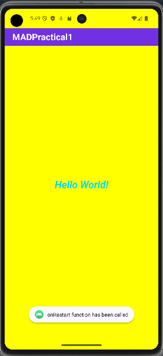

# MAD Practical 2: Android Activity Lifecycle and Toast

This repository contains the source code and explanations related to the **Android Activity Lifecycle** and **Toast messages**. The purpose of this practical is to understand the different states an Activity goes through during its lifecycle and how to display short notifications using Toast.

## Table of Contents
- [Introduction](#introduction)
- [Android Activity Lifecycle](#android-activity-lifecycle)
  - [States of Activity Lifecycle](#states-of-activity-lifecycle)
- [Toast Messages](#toast-messages)
- [Screenshots](#screenshots)
- [Code Explanation](#code-explanation)
- [How to Run](#how-to-run)
- [References](#references)

## Introduction

In Android development, an Activity is a single screen with a user interface. Managing an Activity's lifecycle is essential as it undergoes various stages like creation, start, resume, pause, stop, and destruction.

Additionally, **Toast messages** are small popup notifications used to provide feedback to the user for a brief period.

## Android Activity Lifecycle

The **Activity Lifecycle** is a series of methods that manage the state and behavior of an activity in an Android application. Here are the main callbacks that an Activity can go through during its lifecycle:

### States of Activity Lifecycle

- **onCreate()**: Called when the activity is first created. This is where you initialize components, set up layouts, and do other startup tasks.
- **onStart()**: Called just before the activity becomes visible to the user.
- **onResume()**: Called just before the activity starts interacting with the user. At this point, the activity is in the foreground and the user can interact with it.
- **onPause()**: Called when the system is about to put the activity into the background. This is where you save any unsaved data.
- **onStop()**: Called when the activity is no longer visible to the user.
- **onDestroy()**: Called before the activity is destroyed. This is where cleanup operations should take place.

## Toast Messages

A **Toast** is a simple, short-lived message that appears on the screen to inform the user about a particular event or status in the app. The Toast automatically disappears after a few seconds.

### Example:
```java
Toast.makeText(getApplicationContext(), "This is a Toast message", Toast.LENGTH_SHORT).show();
